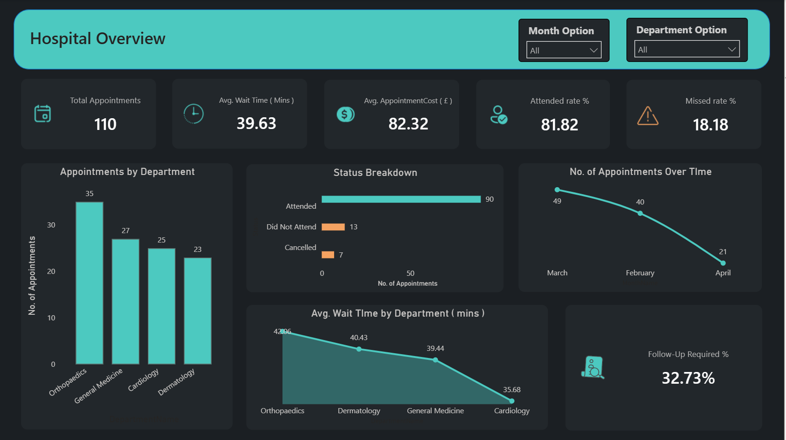
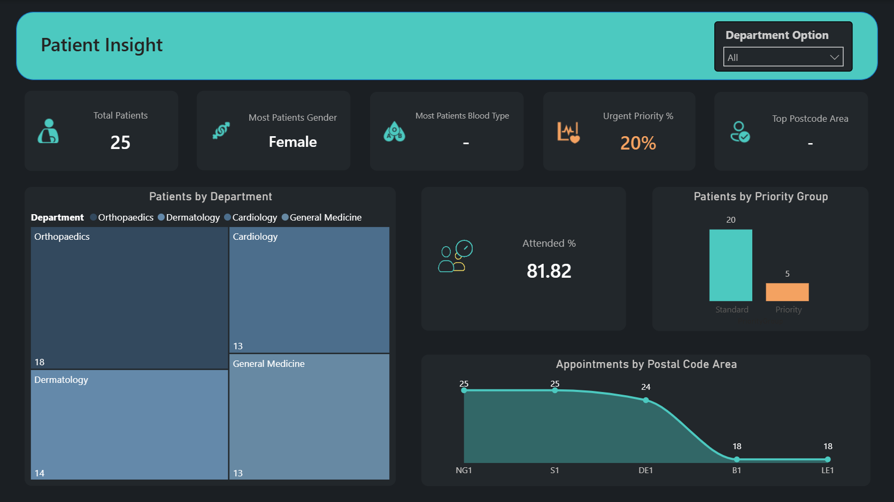
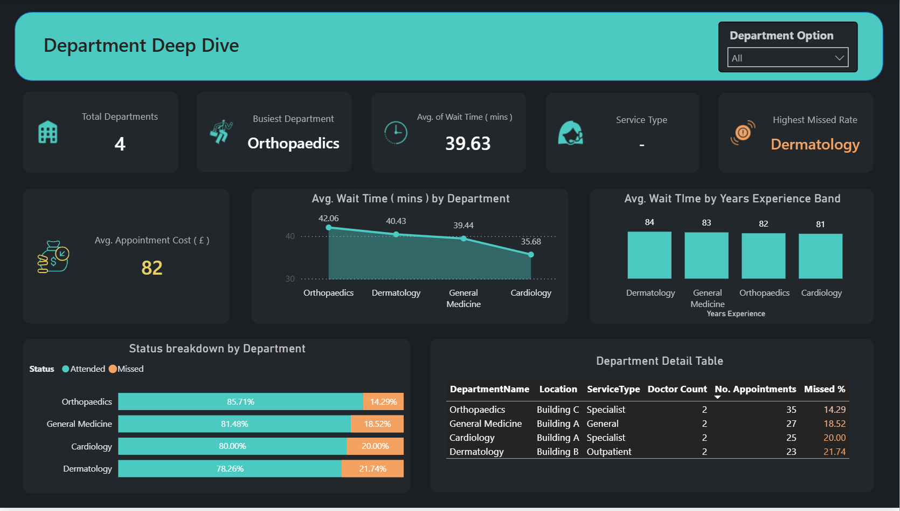
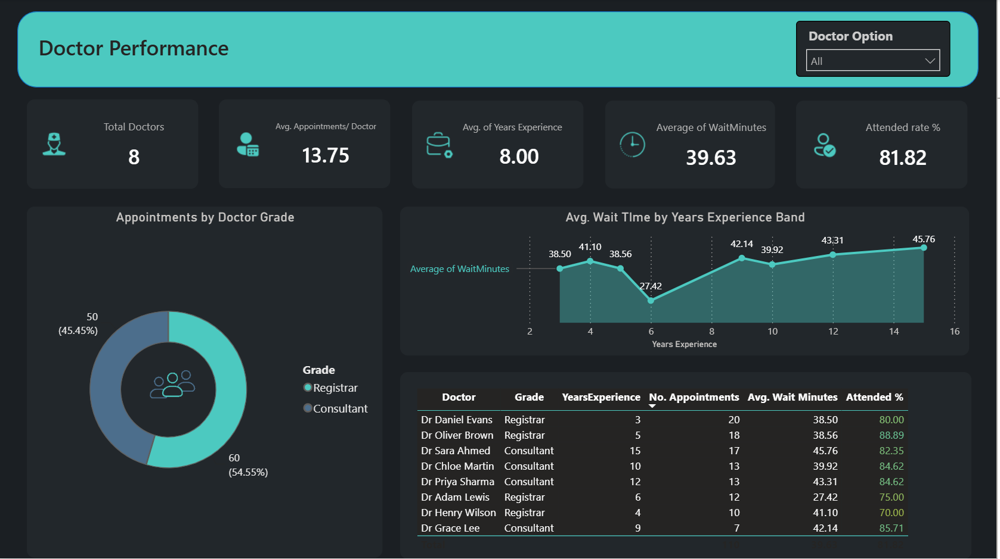
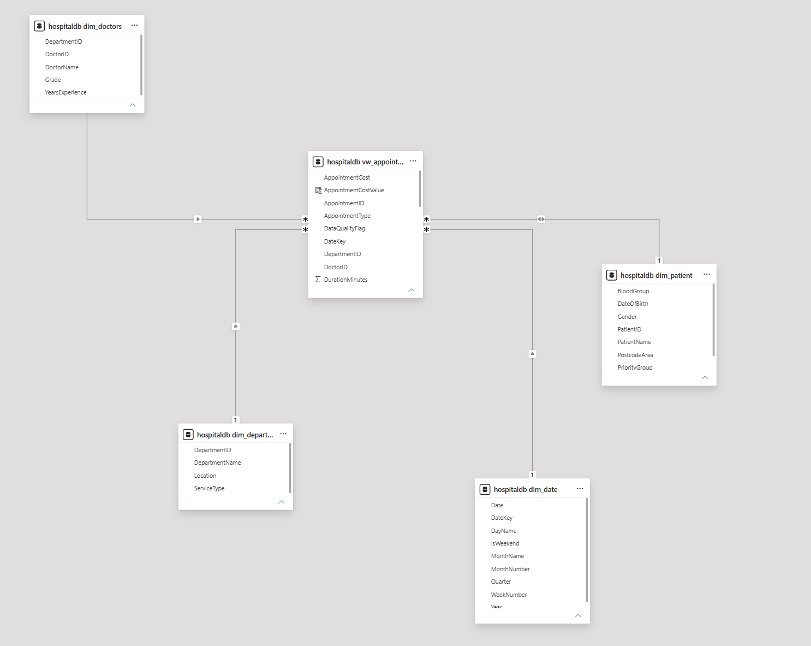

# Hospital Management Dashboard (Power BI)

An interactive Power BI dashboard analyzing hospital operations — built on a star schema data model connecting appointment, patient, doctor, department, and date data to track wait times, attendance, and department performance across the hospital.

## 🔗 Live Interactive Dashboard
[View Walkthrough Video](HospitalManagementSystem.gif)

## 📊 Preview

## 🛠 Tools & Techniques Used
* Power BI Desktop
* MySQL: source database (`hospitaldb`) for appointment, patient, doctor, and department data
* SQL: schema creation and data cleaning/error-fixing (`hospital_mySQL.sql`, `error_fixing_hospital.sql`)
* Star schema data modeling: `vw_appointment` fact view connected to `dim_doctors`, `dim_department`, `dim_patient`, and `dim_date` dimension tables
* Relationship modeling: one-to-many relationships with single and both cross-filter directions to ensure filters propagate correctly across the model
* DAX: custom measures for wait time, attendance rate, and cost calculations
* Interactive features: slicers (Department, Doctor, Month) for report navigation
* Visual polish: icons, KPI cards, consistent formatting/alignment, and conditional formatting (e.g. missed rate, attended %)

## 📌 Report Breakdown
* **Hospital Overview:** high-level metrics — total appointments, avg. wait time, avg. cost, attended/missed rates — with department and month slicers
* **Patient Insight:** patient demographics, priority group breakdown, and appointments by postcode area
* **Department Deep Dive:** wait time and missed-rate comparison across departments, with a detailed department table (location, service type, doctor count)
* **Doctor Performance:** appointments and attendance rate by doctor, grade breakdown (Registrar vs. Consultant), and wait time by years of experience

## 🔧 Skills Demonstrated
* Designing and implementing a star schema from raw relational (MySQL) data
* Cleaning and fixing data quality issues in SQL before modeling
* Managing table relationships (one-to-many, single vs. cross-filter direction)
* Writing DAX measures for operational performance analysis
* Building slicer-driven interactive filtering across report pages
* Evaluating wait time, attendance, and cost trends across departments and doctors

## 📂 Files
* `Hospital Management Dashboard.pbix` — the full Power BI report, feel free to download and explore the model
* `hospital_mySQL.sql` — schema and source queries for `hospitaldb`
* `error_fixing_hospital.sql` — data cleaning / error-fixing queries
* `mySqlHospital.png` — MySQL schema/table preview
* `HospitalManagementSystem.gif` — walkthrough video of the dashboard
